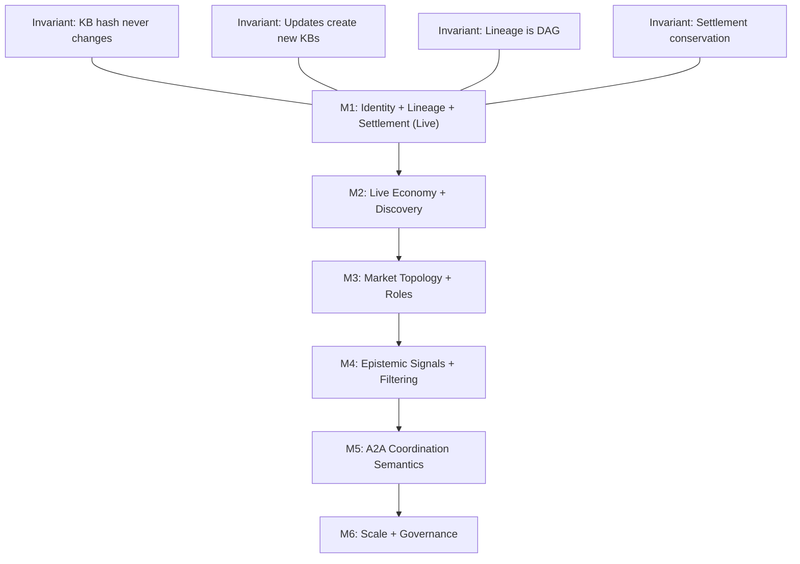
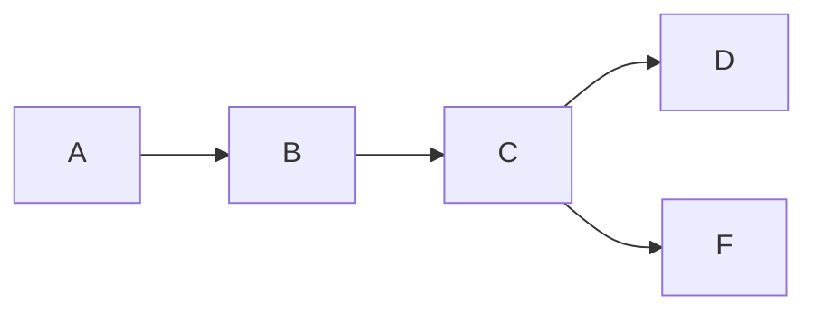

#  🏛 Alexandrian Protocol   
[](https://github.com/jlo-code/alexandria-protocol-v3/actions/workflows/ci.yml)
[](https://basescan.org/address/0x5D6dee4BB3E70f3e8118223Bf297B2eEdBC5B000)
[](https://basescan.org/address/0x5D6dee4BB3E70f3e8118223Bf297B2eEdBC5B000)
[](<your-subgraph-link>)
[](<your-cid-link>)

A deterministic knowledge identity and settlement protocol for autonomous systems.

---

## 🔗 Quick Links

| Document | Path |
|---|---|
| ✅ Verify M1 | [docs/VERIFY-M1.md](docs/VERIFY-M1.md) |
| The Graph | [docs/grants/GRANT-THE-GRAPH.md](docs/grants/GRANT-THE-GRAPH.md) |
| Coinbase | [docs/grants/GRANT-COINBASE.md](docs/grants/GRANT-COINBASE.md) |
| IPFS | [docs/grants/GRANT-IPFS.md](docs/grants/GRANT-IPFS.md) |
| M2 Funding Execution Plan | [docs/grants/M2-FUNDING-EXECUTION-PLAN.md](docs/grants/M2-FUNDING-EXECUTION-PLAN.md) |

---

## 🧩 The Problem

Modern AI stacks can generate outputs, retrieve information, orchestrate workflows,
transfer value, persist artifacts, and index topology.

However, they lack a foundational primitive:

**A canonical identity and settlement layer for structured knowledge.**

Without it:

- Knowledge is regenerated rather than canonically addressed
- Attribution lacks protocol-level enforcement
- Lineage is reconstructed post hoc instead of encoded structurally
- Utility is measured privately rather than emitted as public signal
- Reuse does not compound across systems

This limitation is not intelligence.

It is missing infrastructure.

---

## ⚙️ The Protocol

Alexandrian introduces the missing primitive.

A minimal, three-primitive epistemic substrate:

```text
kbHash = keccak256("KB_V1" || JCS(normalize(envelope)))
```

| Primitive | What it does |
|---|---|
| **Deterministic identity** | Ensures canonical knowledge identity across machines and environments |
| **Immutable lineage DAG** | Enforces derivation structure as an acyclic graph on-chain |
| **Settlement + royalty routing** | Couples knowledge reuse to atomic, lineage-aware value flow |


An A2A epistemic economy emerges when: 
- Identity is canonical
- Derivation is immutable
- Usage produces public signals 
- Coordination occurs through shared `kbHash` reference

Agents coordinate not through regeneration, but through shared references to stable epistemic primitives.

---

 ## 📦 Knowledge Block (KB): The Primitive

  A **Knowledge Block (KB)** is the protocol’s atomic knowledge object: a
  canonical envelope of content, metadata, and lineage commitments that
  produces a stable `kbHash`.

  A KB is the primitive for deterministic knowledge identity because:
  - the envelope is normalized canonically (`JCS(normalize(envelope))`)
  - identity is derived deterministically (`keccak256("KB_V1" ||
  canonicalEnvelope)`)
  - the same KB always yields the same `kbHash` across machines and
  environments

  In Alexandrian, agents do not coordinate by regenerating content; they
  coordinate by referencing the same KB identity.

---

## 🏗 Architecture

```
 Agents / Orchestrators
         │
         ▼
 Alexandrian Protocol Layer
 ├── Deterministic identity   (kbHash from canonical envelope)
 ├── Immutable lineage DAG    (on-chain acyclic parent graph)
 ├── Settlement routing       (royalties propagated atomically)
 └── Proof derivation         (verifiable from logs)
         │
         ├── Base        — identity anchor + economic settlement
         ├── IPFS        — artifact integrity (content-addressed bytes)
         └── The Graph   — topology indexing + usage signals
```

Each layer is non-redundant.
Base anchors economic truth (settlement layer). IPFS anchors artifact integrity (content layer). The Graph exposes topology and signals (indexing layer).

---

## 🌐 Why This Matters for A2A

| Agent Limitation | Alexandrian Mechanism |
|---|---|
| Probalistic Regeneration | Identity-anchored KB reference |
| Session-scoped memory | Cross-session immutable KB objects |
| Informal Derivation Tracking | On-chain DAG-backed lineage |
| Opaque Tool Execution | Tool schemas and outputs as KBs |
| Context window Constraints | Reference-by-hash instead of re-ingestion |
| Hidden Ancestry | Public lineage + settlement trace |
| Non-Reproducible Outputs | Canonical identity reproducibility |
| No Shared Utility Metric | Settlement-derived public signals |

Deterministic identity, immutable ancestry, and public economic signals enable trustless A2A coordination.

---

## 🛣 Milestone Progression



Core identity and settlement invariants are fixed at M1; subsequent milestones extend functionality without modifying these guarantees.

---

## 🟢 Live Deployment

M1 is live on Base Mainnet, the Graph and IPFS. Identity, lineage, and settlement are verifiable on-chain now.

| Layer | Component | Network | Link |
|---|---|---|---|
| Layer 1 · Identity & Settlement | `AlexandrianRegistryV2` | Base Mainnet (chainId 8453) | [0x5D6dee4...5B000 ↗](https://basescan.org/address/0x5D6dee4BB3E70f3e8118223Bf297B2eEdBC5B000) |
| Layer 2 · Artifact Storage | KB-F artifact | IPFS | [bafybeia...sk57y ↗](https://ipfs.io/ipfs/bafybeiajbvsdiapsbbajz6ul5m5bsbpmm7wjjohrcrpu2g2fmhe3ysk57y/kb-f/artifact.json) |
| Layer 3 · Discovery & Indexing | Subgraph (The Graph Studio) | Base Mainnet | [alexandrian-protocol/version/latest ↗](https://api.studio.thegraph.com/query/1742359/alexandrian-protocol/version/latest) |

---

## 🧠 Knowledge Block Registry

5 settlements executed on chain with invariant-preserving royalty propagation.



| KB | kb Hash | Publish Tx | Parent | IPFS CID |
|----|---------|------------|--------|----------|
| KB-A | [`0x2f00aff3...`](https://basescan.org/tx/0x1d1e959edf9cfb01db087ff6cf0b8910e9aa67c4b2d434b908fbc4c86017dd6e) | [`0x1d1e959e...`](https://basescan.org/tx/0x1d1e959edf9cfb01db087ff6cf0b8910e9aa67c4b2d434b908fbc4c86017dd6e) | — | — |
| KB-B | [`0xf65dbddb...`](https://basescan.org/tx/0x6f724f7810927ff8b41ffc8755fd52d3e904ba5bb9a7b4e405194bff1ac0a3a8) | [`0x6f724f78...`](https://basescan.org/tx/0x6f724f7810927ff8b41ffc8755fd52d3e904ba5bb9a7b4e405194bff1ac0a3a8) | KB-A | — |
| KB-C | [`0x451f7581...`](https://basescan.org/tx/0x520eb4d1550baf510a974c2e4602a79a8fe8252c4921ff503a1fc5a26ea4dfb6) | [`0x520eb4d1...`](https://basescan.org/tx/0x520eb4d1550baf510a974c2e4602a79a8fe8252c4921ff503a1fc5a26ea4dfb6) | KB-A, KB-B | — |
| KB-D | [`0x268d784d...`](https://basescan.org/tx/0x83233ec285d3dbd06b715aa34c5de3f500789f1e685e2c20f2fe1d3384a7050c) | [`0x83233ec2...`](https://basescan.org/tx/0x83233ec285d3dbd06b715aa34c5de3f500789f1e685e2c20f2fe1d3384a7050c) | KB-C | — |
| KB-F | [`0x83a6aad1...`](https://basescan.org/tx/0x4afd4de47dbb47bdb9f5871f2e7fa9180ae93acce988a3221cb31b79c6f257de) | [`0x4afd4de4...`](https://basescan.org/tx/0x4afd4de47dbb47bdb9f5871f2e7fa9180ae93acce988a3221cb31b79c6f257de) | KB-C | [`bafybeia...sk57y`](https://ipfs.io/ipfs/bafybeiajbvsdiapsbbajz6ul5m5bsbpmm7wjjohrcrpu2g2fmhe3ysk57y) |

---

# 💰 M1 Settlement Proof

## KB-D Lifecycle — End-to-End

Canonical lifecycle verified on-chain:

| Step | Transaction |
|------|------------|
| Publish KB-D | [`0x83233ec...`](https://basescan.org/tx/0x83233ec285d3dbd06b715aa34c5de3f500789f1e685e2c20f2fe1d3384a7050c) |
| Settle KB-D (0.001 ETH) | [`0x87288b5c...`](https://basescan.org/tx/0x87288b5c76651cf92789437f9e29e5b1c68fea5fa3ca33b11c3dc5a875b5c10f) |
| Withdraw earnings | [`0x79da1704...`](https://basescan.org/tx/0x79da1704354b4297882d3cd2045b966f0d9030d584ec35ec37910b6ced419ddd) |

This demonstrates:
- Deterministic identity registration
- Lineage-aware settlement execution
- Royalty propagation
- Withdrawal finality

All value transfers are executed and enforced on-chain.

---

## 💰 Royalty Distribution (Economic Invariant)

**Settlement:** 0.001 ETH

**Distribution:**
- 19.6% → KB-C curator (parent royalty)
- 78.4% → KB-D curator
- 2% → Protocol fee

Zero wei created or lost.

| Tx | Recipient | Role | Amount |
|----|-----------|------|--------|
| [`0x87288b5c...`](https://basescan.org/tx/0x87288b5c76651cf92789437f9e29e5b1c68fea5fa3ca33b11c3dc5a875b5c10f) | [`0x797e03...`](https://basescan.org/address/0x797e03A3123d09B40fcD536388182B88c6DFAFc7) | KB-C curator (parent royalty) | 0.000196 ETH |
| [`0x87288b5c...`](https://basescan.org/tx/0x87288b5c76651cf92789437f9e29e5b1c68fea5fa3ca33b11c3dc5a875b5c10f) | [`0x370750...`](https://basescan.org/address/0x370750Dad9cC8e62C9b95A66dB6F3204DE056a73) | KB-D curator | 0.000784 ETH |

5 settlements executed on-chain with consistent routing.

The economic conservation invariant holds across all events.

---

## 🔎 Independent Verification (The Graph)

The following query independently reproduces settlement routing and royalty distribution:

```graphql
{
  settlements(first: 5, orderBy: timestamp, orderDirection: desc) {
    txHash
    value
    timestamp
    kb {
      contentHash
      settlementCount
      totalSettledValue
    }
    payer { id }
    royalties {
      recipient { id }
      kb { id }
      amount
    }
  }
}
```
---

## 📚 Documentation

### Protocol
- [PROTOCOL-SPEC.md](docs/protocol/PROTOCOL-SPEC.md)
- [INVARIANTS.md](docs/protocol/INVARIANTS.md)
- [VERIFY-M1.md](docs/VERIFY-M1.md)

### Epistemic Economy
- [AI-RELIABILITY-SUBSTRATE.md](docs/AI-RELIABILITY-SUBSTRATE.md)
- [EPISTEMIC-ECONOMY-POSITIONING.md](docs/EPISTEMIC-ECONOMY-POSITIONING.md)
- [EPISTEMIC-ECONOMY-BRIEF.md](docs/EPISTEMIC-ECONOMY-BRIEF.md)
- [EPISTEMIC-ECONOMY-MILESTONES.md](docs/EPISTEMIC-ECONOMY-MILESTONES.md)

### Grants & Execution
- [M2-FUNDING-EXECUTION-PLAN.md](docs/grants/M2-FUNDING-EXECUTION-PLAN.md)
- [LIVE-DEMO-PROOF.md](docs/grants/LIVE-DEMO-PROOF.md)
