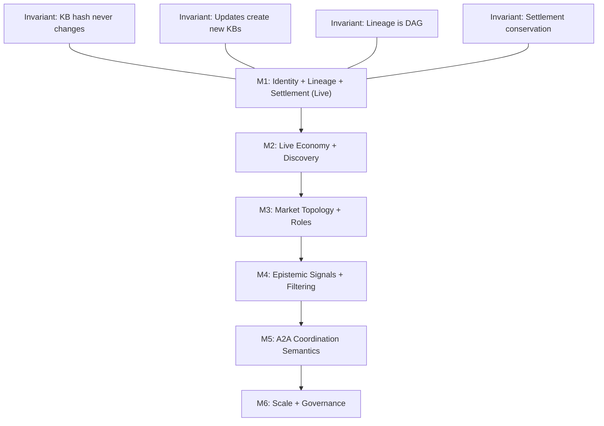
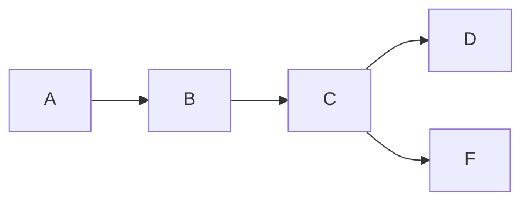

#  🏛 Alexandrian Protocol: AI-Powered Reusable Knowledge Infrastructure for Developers

> *A continuously evolving library of structured, attributable knowledge — designed to make useful information easier for AI systems to interpret, reuse, and build upon.*

[](https://github.com/alexandrianprotocol/alexandrian-protocol/actions/workflows/ci.yml)
[](https://basescan.org/address/0xD1F216E872a9ed4b90E364825869c2F377155B29)
[](https://basescan.org/address/0xD1F216E872a9ed4b90E364825869c2F377155B29)
[](https://api.studio.thegraph.com/query/1742359/alexandrian-protocol/version/latest)
[](https://ipfs.io/ipfs/bafybeiajbvsdiapsbbajz6ul5m5bsbpmm7wjjohrcrpu2g2fmhe3ysk57y/kb-f/artifact.json)
[](https://basescan.org/address/0xD1F216E872a9ed4b90E364825869c2F377155B29)

**A structured knowledge layer for AI agents — attributable, versioned, and designed for reliable machine use.**

Alexandrian provides a continuously expanding library of procedures, standards, reference materials, curated excerpts, practice examples, and state representations — all organized for reliable machine consumption. Every entry carries on-chain attribution, a stable identity, and automatic royalty settlement flowing through the entire contribution lineage.

## Project Overview

Alexandrian is a developer-focused infrastructure layer that elevates one-time problem solving into permanent, reusable knowledge.

Developers can capture structured answers once as Knowledge Blocks (KBs), reuse them across projects and agents, and continuously improve them through stable identity and versioned lineage.

This creates compounding execution speed, lower operating cost, stronger output quality, and increasingly consistent implementation patterns over time.

## Dual Payments (Web2 + Web3) & Compliance Note

Alexandrian supports a secure dual-rail payments model:
- Web2 rail: Stripe
- Web3 rail: wallet-based on-chain settlement

For the end-to-end payment state machine, API contracts, settlement guards, and reconciliation steps, see `docs/ops/DUAL-PAYMENTS-ARCHITECTURE.md` and `docs/ops/DUAL-PAYMENTS-IMPLEMENTATION-STEPS.md`.

Important compliance note: the current checkout endpoints use header-based identity scoping (`x-user-id`) to protect payment ownership. A planned enhancement for stricter OWASP Top 10 / SOC2-style controls is to bind `x-user-id` to verified auth tokens (JWT/session) and reject unsigned or invalid identities.

## Product Flow: Base + The Graph + IPFS

Alexandrian’s developer experience is delivered through three integrated components:

- `Base` — settlement rail + identity anchor (royalty-routing settlement recorded and verifiable on-chain)
- `The Graph` — discovery and coordination surface (signals for finding high-signal Knowledge Blocks)
- `IPFS` — content storage vault (artifacts resolved by CID, with integrity/verification workflows)

In the product experience, an agent/developer can:
1. use `The Graph` to discover the right KBs by domain + activity signals
2. fetch the matching artifact from `IPFS` for structured, verifiable content
3. anchor settlement and attribution through `Base`

## Release Versions: M1 (Live) and M2 (Product Hardening)

### M1 — Core Epistemic Substrate (Live)
M1 delivers the deterministic, verifiable foundation:
- deterministic Knowledge Block identity (`kbHash`)
- immutable lineage DAG
- settlement + royalty routing with independently reproducible verification

Independent verification: `docs/VERIFY-M1.md` and the end-to-end proof package: `docs/grants/LIVE-DEMO-PROOF.md`.

### M2 — Developer Experience + Production Readiness
M2 focuses on making the system feel straightforward to use and easy to trust:
- knowledge-native CLI/SDK verb surface (`compose`, `analyze`, `refine`, `revise`, `apply`, `learn`)
- confidence tooling: `alex grade` and `alex benchmark run` to quantify system health and regressions
- reliability you can see: clear degraded-mode signals when fallback paths are used
- a payments experience that fits the workflow (crypto-first by default; Stripe gated by env)

MVP release is coming soon, with a focus on the shortest path from installation → first command → a graded, reusable outcome.

M2 release gate: `docs/ops/M2-GO-LIVE-CHECKLIST.md`.

## Future Roadmap

The milestone progression is designed to extend capability without modifying the invariants:
`docs/EPISTEMIC-ECONOMY-MILESTONES.md` (M1 → M6).

## Investor Snapshot

Alexandrian is a developer infrastructure layer for AI agents: structured, attributable knowledge that composes like software, and settles economically like infrastructure.

Why investors care:
- **Traction & proof**: 7,000+ live Knowledge Blocks on Base Mainnet and indexed discovery via The Graph (see `docs/grants/LIVE-DEMO-PROOF.md`, `docs/VERIFY-M1.md`).
- **Moat**: deterministic, content-derived identity + lineage + settlement invariants that compound reuse as usage grows.
- **Monetization model**: protocol fees plus M2/M3 revenue levers are modeled in `docs/grants/SUSTAINABILITY-MODEL.md`.
- **Execution clarity (M2)**: funding deliverables and workstreams are precisely defined in `docs/grants/M2-FUNDING-EXECUTION-PLAN.md`.
- **Operational maturity**: governance and release evidence practices are documented in `docs/ops/GOVERNANCE-RUNBOOK.md` and `docs/ops/PRODUCTION-ADOPTION-CHECKLIST.md`.

Key due-diligence links:
- M1 verification: `docs/VERIFY-M1.md`
- M1 proof package: `docs/grants/LIVE-DEMO-PROOF.md`
- M2 release gate: `docs/ops/M2-GO-LIVE-CHECKLIST.md`
- Sustainability model: `docs/grants/SUSTAINABILITY-MODEL.md`

Contact:
- X: https://x.com/alexandrianlabs

**LIVE DEMO: https://alexandrian-protocol.vercel.app/**

**[7,000+ Knowledge Blocks](https://basescan.org/address/0xD1F216E872a9ed4b90E364825869c2F377155B29) are now live on Base Mainnet.**

---

## 🔗 Quick Links

| | |
|---|---|
| ✅ | [Verify M1](docs/VERIFY-M1.md) |
| 🔍 | [On-Chain Settlement Proof](docs/grants/LIVE-DEMO-PROOF.md) |
| 📜 | [Contract on Basescan](https://basescan.org/address/0xD1F216E872a9ed4b90E364825869c2F377155B29) |
| 📊 | [Subgraph Explorer](https://api.studio.thegraph.com/query/1742359/alexandrian-protocol/version/latest) |
| 💰 | [Coinbase Grant](docs/grants/GRANT-COINBASE.md) |
| 🗂 | [The Graph Grant](docs/grants/GRANT-THE-GRAPH.md) |
| 📦 | [IPFS Grant](docs/grants/GRANT-IPFS.md) |

---

## Knowledge-Native CLI

`alex` now uses knowledge-native verbs as the canonical command surface:

- `compose` — build structured KB-driven solutions
- `analyze` — inspect systems and retrieve KB context
- `refine` — improve quality/performance plans
- `revise` — correct issues and generate repair plans
- `apply` — apply prepared plans safely
- `learn` — deep conceptual explanations
- `collection` / `checkout` / `read` / `archive` — library and memory workflows

Examples:

- `alex compose "secure auth system"`
- `alex analyze "audit this API" --layer reasoning --json`
- `alex refine ./project`
- `alex revise "login not persisting"`
- `alex apply plan.json --dry-run`
- `alex learn reentrancy --deep`
- `alex collection install security-pack`
- `alex checkout security-pack`
- `alex archive search security`
- `alex grade --limit 50`

Legacy command names (`build`, `enhance`, `optimize`, `fix`, `explain`, `pack`, `share`, `view`) are removed in this release.

---

## 🧠 [7,000+ Knowledge Blocks](https://basescan.org/address/0xD1F216E872a9ed4b90E364825869c2F377155B29) live on Base Mainnet

**The largest on-chain AI knowledge graph.** Every KB has a canonical `kbHash`, immutable lineage DAG, and royalty-routing settlement — queryable today via [The Graph](https://api.studio.thegraph.com/query/1742359/alexandrian-protocol/version/latest).

| Layer | Status |
|-------|--------|
| [Contract 0xD1F216…](https://basescan.org/address/0xD1F216E872a9ed4b90E364825869c2F377155B29) | Live on Base Mainnet |
| [7,000+ KBs](https://basescan.org/address/0xD1F216E872a9ed4b90E364825869c2F377155B29) | Published on-chain, fully indexed |
| [Subgraph](https://api.studio.thegraph.com/query/1742359/alexandrian-protocol/version/latest) | Live — indexing from block 42593045 |
| [Grant Verification](docs/grants/GRANT-THE-GRAPH.md) | [✅ Basescan](https://basescan.org/tx/0x87288b5c76651cf92789437f9e29e5b1c68fea5fa3ca33b11c3dc5a875b5c10f) · [✅ Subgraph](https://api.studio.thegraph.com/query/1742359/alexandrian-protocol/version/latest) · [✅ IPFS](https://ipfs.io/ipfs/bafybeiajbvsdiapsbbajz6ul5m5bsbpmm7wjjohrcrpu2g2fmhe3ysk57y/kb-f/artifact.json) |

### 📚 Knowledge Block Domains

Knowledge Blocks are organized by domain and type, so agents retrieve not just relevant information, but the **right kind of knowledge for the task** — procedures to execute, checklists to validate against, frameworks to reason through, or rubrics to score with.

#### 🛠 Build & Operate Systems

| Domain | Representative KB | Type | Agent Use |
|--------|-------------------|------|-----------|
| 🔄 CI/CD pipelines | Zero-downtime release pipelines with automated rollback and canary promotion | `Practice` | Execute deployment steps |
| ⚡ Zero-downtime deployments | Rolling and blue-green deploys with health checks and connection drain | `Practice` | Execute rollout sequence |
| 🏗 Microservice architecture | Designing scalable microservice architectures with explicit service boundaries | `StateMachine` | Model system state transitions |
| 📡 Distributed tracing | Building distributed tracing pipelines with context propagation and span aggregation | `Practice` | Instrument tracing pipeline |
| 🔭 Observability & telemetry | Structured logging, distributed metrics, and alerting pipeline design | `Feature` | Configure monitoring stack |
| 📐 Performance engineering | Profiling, load testing, bottleneck identification, and capacity planning | `Practice` | Diagnose and prioritise bottlenecks |

#### 🔐 Secure & Validate Systems

| Domain | Representative KB | Type | Agent Use |
|--------|-------------------|------|-----------|
| 🔐 Auth & access control | Implementing OAuth2, RBAC, and zero-trust access control patterns | `ComplianceChecklist` | Validate access control posture |
| 🛡 Cybersecurity | Threat modeling, red-teaming, and vulnerability triage procedures | `ComplianceChecklist` | Audit threat surface |
| 💰 Financial systems | Payment processing, ledger design, and regulatory compliance procedures | `ComplianceChecklist` | Validate regulatory compliance |
| 📋 Curated standards | High-signal excerpts from NIST, OWASP, and RFC standards — formatted for agent consumption | `ComplianceChecklist` | Enforce standards compliance |

#### 🤖 Design AI Systems

| Domain | Representative KB | Type | Agent Use |
|--------|-------------------|------|-----------|
| 🤖 Agent orchestration | Designing multi-agent orchestration pipelines with role handoffs and conflict resolution | `Feature` | Route tasks between agents |
| 🧩 Task decomposition | Implementing hierarchical task decomposition for complex agent goals | `Practice` | Break goals into executable steps |
| 🔍 Semantic routing | Designing semantic routing systems via embedding similarity to capability descriptions | `Feature` | Route queries to the right capability |
| 📊 LLM evaluation | Designing LLM evaluation pipelines with metric tracking and regression detection | `Rubric` | Score and compare model outputs |

#### 📊 Data & Knowledge

| Domain | Representative KB | Type | Agent Use |
|--------|-------------------|------|-----------|
| 🗄 RAG systems | Designing retrieval-augmented generation pipelines with reranking and citation | `Feature` | Select and apply retrieval strategy |
| 📈 ML/MLOps | Model deployment, feature stores, drift detection, and experiment tracking | `Practice` | Execute ML pipeline steps |
| 🌐 Web3 / on-chain | Smart contract patterns, gas optimisation, and on-chain settlement design | `Feature` | Apply on-chain design patterns |
| 📖 Concepts & definitions | CAP theorem, Byzantine fault tolerance, distributed systems concepts | `Practice` | Ground reasoning in precise definitions |
| 🧪 Worked examples | Annotated secure authentication flows with failure modes and verification criteria | `Practice` | Apply a validated pattern to implementation |

#### What retrieval looks like in practice

> **Query:** `"setup ci cd github actions docker"`
>
> → **Domain inferred:** `engineering.ops`
>
> → **KBs retrieved:**
> | Type | KB | Used for |
> |------|----|----------|
> | `Practice` | CI/CD pipeline steps | Execute deployment |
> | `Practice` | Docker multi-stage build pattern | Apply to image |
> | `ComplianceChecklist` | Deployment readiness checklist | Validate before ship |
>
> → **Result:** LLM receives expert-scoped context, not a generic question.

---

## 🧩 The Problem

Modern AI stacks can generate outputs, retrieve information, orchestrate workflows, transfer value, persist artifacts, and index topology. However, they lack a foundational primitive:

**A canonical identity and settlement layer for structured knowledge.**

Without it, knowledge cannot be:

- **Attributed** — contribution lacks protocol-level enforcement
- **Compounded** — derivation is reconstructed post hoc instead of encoded structurally
- **Discovered** — utility is measured privately rather than emitted as public signal
- **Retrieved efficiently** — the same work is regenerated repeatedly instead of addressed by stable identity
- **Coordinated on** — agents have no shared, addressable reference for knowledge objects

This is not a capability problem. What's missing is a canonical identity and settlement layer for knowledge.

> For the full roadmap of where this leads: [`EPISTEMIC-ECONOMY-MILESTONES.md`](docs/EPISTEMIC-ECONOMY-MILESTONES.md) · [`AI-RELIABILITY-SUBSTRATE.md`](docs/AI-RELIABILITY-SUBSTRATE.md)

**Alexandrian is that layer.**

---

## 🎯 Purpose: Query Enhancement & Solution Templates

Both are real; they relate like this:

| Mode | What it is |
|------|------------|
| **Structured knowledge artifacts** | What the current demo does: KBs as structured knowledge — procedures, standards, reference material, curated excerpts, and examples. You query the KB and it returns organized, typed knowledge — **the KB is the answer**. Valuable across the full spectrum of knowledge types, not just procedures. |
| **Query enhancement** | The deeper core: **the KB crystallizes what the question actually means at an expert level** — then the LLM answers a precisely scoped prompt, and the matched KB earns settlement because its context shaped the answer. |

**Mechanism (example).** User asks: *“How do I secure my login endpoint?”*

- **Without Alexandrian** — the LLM gets that vague sentence → a generic answer (HTTPS, hashing).
- **With Alexandrian** — the system matches the query to **KB-ENG-4** (*Security ComplianceChecklist*) and **injects** expert scope: JWT RS256/ES256 validation, IDOR checks, Redis-backed rate limiting (5 req/min/IP on auth endpoints), OWASP API Top 10 audit. The model answers a much sharper question; **KB-ENG-4 earns settlement** because its context shaped the answer.

The user who says “secure my API” may not know to ask about JWT algorithm pinning, IDOR, or OWASP API4. **The KB does.** That’s the value transfer.

**Why query enhancement is the stronger product direction**

- **Infrastructure, not content** — Every agent pipeline already calls an LLM. Alexandrian is middleware that makes *every query smarter*. You’re not competing with documentation sites; you sit **in front of** LLM calls.
- **Attribution fits naturally** — If a KB was injected and the answer was good, settlement traces causation.
- **Scales with the graph** — More KBs → better matching → better intent definition → better answers; the protocol gets more valuable as it grows.
- **Adoption as capability** — The pitch isn’t “replace ChatGPT.” It’s *run queries through Alexandrian’s KB router first so your existing LLM gets context that would have taken years to encode.*

**Synthesis.** Structured knowledge artifacts — procedures, references, standards, examples — are the **content** Alexandrian needs to be useful. Query enhancement is the **mechanism** that makes that content economically valuable. They aren’t competing — the library is what’s *in* Alexandrian; enhancement is how the library gets *used*. **The narrative leads with enhancement**, because that’s what’s new: abundant knowledge exists elsewhere; nobody yet has a decentralized, attributed, agent-native **context injection** layer built on a structured, typed, and versioned knowledge graph.

> *A structured knowledge layer for AI agents* — not a static library, but **living infrastructure your agents consult before every call.**

---

## ⚙️ The Protocol

Alexandrian introduces the missing primitive.

A minimal, three-primitive epistemic substrate:

```text
kbHash = keccak256("KB_V1" || JCS(normalize(envelope)))
```

| Primitive | What it does |
|---|---|
| **Deterministic identity** | Every KB has a stable, canonical address — attributed, retrievable, and referenceable across systems |
| **Immutable lineage DAG** | Derivation is encoded on-chain, not reconstructed — knowledge compounds across contributors |
| **Settlement + royalty routing** | Usage triggers atomic, lineage-aware ETH settlement — attribution is enforced, not assumed |

An A2A epistemic economy emerges when:

- Identity is canonical
- Derivation is immutable
- Usage produces public signals
- Coordination occurs through shared `kbHash` reference

Agents coordinate not through regeneration, but through shared references to stable, canonical Knowledge Blocks.

---

## 📦 Knowledge Block (KB): The Primitive

A **Knowledge Block (KB)** is the protocol's atomic knowledge object: a canonical envelope of structured knowledge — procedures, standards, reference material, curated excerpts, examples, or state representations — together with metadata and lineage commitments that produce a stable `kbHash`.

A KB is the primitive for deterministic knowledge identity because:

- the envelope is normalized canonically (`JCS(normalize(envelope))`)
- identity is derived deterministically (`keccak256("KB_V1" || canonicalEnvelope)`)
- the same KB always yields the same `kbHash` across machines and environments

In Alexandrian, agents do not coordinate by regenerating content; they coordinate by referencing the same KB identity.

---

## Architecture

```
Agents / Orchestrators
  └── bring a wallet          (identity + signing)
  └── stake a Knowledge Block (reputation + attribution)
         │
         ▼
Alexandrian Protocol
  └── anchors identity        (kbHash — canonical, content-derived)
  └── enforces lineage        (immutable DAG — who built on what)
  └── routes settlement       (ETH flows atomically across contributors)
         │
         ├── Base        — settlement rail + identity anchor
         ├── IPFS        — content vault (artifact integrity by CID)
         └── The Graph   — coordination surface (discovery, ranking, signals)
```

| Layer | Responsibility | Live |
|---|---|---|
| **Base** | Settlement rail + identity anchor | [Contract](https://basescan.org/address/0xD1F216E872a9ed4b90E364825869c2F377155B29) · [Settlement tx](https://basescan.org/tx/0x87288b5c76651cf92789437f9e29e5b1c68fea5fa3ca33b11c3dc5a875b5c10f) |
| **IPFS** | Content vault — artifact integrity by CID | [KB-F artifact](https://ipfs.io/ipfs/bafybeiajbvsdiapsbbajz6ul5m5bsbpmm7wjjohrcrpu2g2fmhe3ysk57y/kb-f/artifact.json) |
| **The Graph** | Coordination surface — discovery, ranking, signals | [Subgraph](https://api.studio.thegraph.com/query/1742359/alexandrian-protocol/version/latest) |

---

## Protocol in Practice

### Querying a Knowledge Block

```
Agent (wallet)
  └── queries subgraph        (find high-signal KB by domain + settlementCount)
  └── retrieves by kbHash     (stable identity — same address everywhere)
  └── calls settleQuery       (ETH routed atomically to all contributors)
         │
         ├── Base        — settlement recorded on-chain
         ├── IPFS        — artifact resolved by CID
         └── The Graph   — settlementCount updated, signal strengthened
```

### Publishing a Knowledge Block

```
Agent (wallet)
  └── normalizes envelope     (JCS canonical form)
  └── derives kbHash          (deterministic — content drives identity)
  └── calls publishKB         (identity + lineage written on-chain)
         │
         ├── Base        — KB identity anchored, lineage edges recorded
         ├── IPFS        — artifact pinned by CID
         └── The Graph   — new KnowledgeBlock node indexed, discoverable
```

### Building on Prior Work

```
Agent (wallet)
  └── queries subgraph        (find parent KBs by domain + lineage depth)
  └── derives new kbHash      (parent hashes encoded in envelope)
  └── calls publishKB         (parent edges written on-chain)
         │
         ├── Base        — derivation edge immutable in DAG
         ├── IPFS        — new artifact anchored by CID
         └── The Graph   — lineage traversal extended, topology updated
```

### Withdrawing Earnings

```
Agent (wallet)
  └── accumulated royalties   (from all settlements across lineage)
  └── calls withdraw          (ETH transferred to contributor address)
         │
         └── Base        — economic conservation verified on-chain
```

---

## 🌐 Why This Matters for A2A

| Agent Limitation | Alexandrian Mechanism |
|---|---|
| Probabilistic Regeneration | Identity-anchored KB reference |
| Session-scoped memory | Cross-session immutable KB objects |
| Informal Derivation Tracking | On-chain DAG-backed lineage |
| Opaque Tool Execution | Tool schemas and outputs as KBs |
| Context window Constraints | Reference-by-hash instead of re-ingestion |
| Hidden Ancestry | Public lineage + settlement trace |
| Non-Reproducible Outputs | Canonical identity reproducibility |
| No Shared Utility Metric | Settlement-derived public signals |

Deterministic identity, immutable ancestry, and public economic signals enable trustless A2A coordination.

---

## 🛣 Milestone Progression



Core identity and settlement invariants are fixed at M1; subsequent milestones extend functionality without modifying these guarantees.

---

## M1 Status

M1 is live on Base Mainnet. All invariants hold.

| Capability | Status |
|---|---|
| Deterministic KB identity | ✅ Live |
| Immutable lineage DAG | ✅ Live |
| Settlement + royalty routing | ✅ Live |
| On-chain economic conservation | ✅ Verified |
| Subgraph indexing | ✅ Live — 7,000+ KBs from block 42593045 |
| IPFS artifact anchoring | ✅ Live |

Verify independently: `pnpm verify` — see [`VERIFY-M1.md`](docs/VERIFY-M1.md)

---

## 📋 Genesis KB Registry

Genesis DAG (KB-A through KB-F) — the canonical proof-of-concept lineage. [7,000+ KBs](https://basescan.org/address/0xD1F216E872a9ed4b90E364825869c2F377155B29) now live on Base Mainnet with invariant-preserving royalty propagation.



| KB | KB Hash | Publish Tx | Parent | IPFS CID |
|----|---------|------------|--------|----------|
| KB-A | [`0x2f00aff3...`](https://basescan.org/tx/0x1d1e959edf9cfb01db087ff6cf0b8910e9aa67c4b2d434b908fbc4c86017dd6e) | [`0x1d1e959e...`](https://basescan.org/tx/0x1d1e959edf9cfb01db087ff6cf0b8910e9aa67c4b2d434b908fbc4c86017dd6e) | — | — |
| KB-B | [`0xf65dbddb...`](https://basescan.org/tx/0x6f724f7810927ff8b41ffc8755fd52d3e904ba5bb9a7b4e405194bff1ac0a3a8) | [`0x6f724f78...`](https://basescan.org/tx/0x6f724f7810927ff8b41ffc8755fd52d3e904ba5bb9a7b4e405194bff1ac0a3a8) | KB-A | — |
| KB-C | [`0x451f7581...`](https://basescan.org/tx/0x520eb4d1550baf510a974c2e4602a79a8fe8252c4921ff503a1fc5a26ea4dfb6) | [`0x520eb4d1...`](https://basescan.org/tx/0x520eb4d1550baf510a974c2e4602a79a8fe8252c4921ff503a1fc5a26ea4dfb6) | KB-A, KB-B | — |
| KB-D | [`0x268d784d...`](https://basescan.org/tx/0x83233ec285d3dbd06b715aa34c5de3f500789f1e685e2c20f2fe1d3384a7050c) | [`0x83233ec2...`](https://basescan.org/tx/0x83233ec285d3dbd06b715aa34c5de3f500789f1e685e2c20f2fe1d3384a7050c) | KB-C | — |
| KB-F | [`0x83a6aad1...`](https://basescan.org/tx/0x4afd4de47dbb47bdb9f5871f2e7fa9180ae93acce988a3221cb31b79c6f257de) | [`0x4afd4de4...`](https://basescan.org/tx/0x4afd4de47dbb47bdb9f5871f2e7fa9180ae93acce988a3221cb31b79c6f257de) | KB-C | [`bafybeia...sk57y`](https://ipfs.io/ipfs/bafybeiajbvsdiapsbbajz6ul5m5bsbpmm7wjjohrcrpu2g2fmhe3ysk57y) |

---

## 💰 M1 Settlement Proof

### KB-D Lifecycle — End-to-End

Canonical lifecycle verified on-chain:

| Step | Transaction |
|------|------------|
| Publish KB-D | [`0x83233ec...`](https://basescan.org/tx/0x83233ec285d3dbd06b715aa34c5de3f500789f1e685e2c20f2fe1d3384a7050c) |
| Settle KB-D (0.001 ETH) | [`0x87288b5c...`](https://basescan.org/tx/0x87288b5c76651cf92789437f9e29e5b1c68fea5fa3ca33b11c3dc5a875b5c10f) |
| Withdraw earnings | [`0x79da1704...`](https://basescan.org/tx/0x79da1704354b4297882d3cd2045b966f0d9030d584ec35ec37910b6ced419ddd) |

This demonstrates:

- Deterministic identity registration
- Lineage-aware settlement execution
- Royalty propagation
- Withdrawal finality

All value transfers are executed and enforced on-chain.

---

### 💸 Royalty Distribution (Economic Invariant)

**Settlement:** 0.001 ETH

**Distribution:**
- 19.6% → KB-C curator (parent royalty)
- 78.4% → KB-D curator
- 2% → Protocol fee

Zero wei created or lost.

| Tx | Recipient | Role | Amount |
|----|-----------|------|--------|
| [`0x87288b5c...`](https://basescan.org/tx/0x87288b5c76651cf92789437f9e29e5b1c68fea5fa3ca33b11c3dc5a875b5c10f) | [`0x797e03...`](https://basescan.org/address/0x797e03A3123d09B40fcD536388182B88c6DFAFc7) | KB-C curator (parent royalty) | 0.000196 ETH |
| [`0x87288b5c...`](https://basescan.org/tx/0x87288b5c76651cf92789437f9e29e5b1c68fea5fa3ca33b11c3dc5a875b5c10f) | [`0x370750...`](https://basescan.org/address/0x370750Dad9cC8e62C9b95A66dB6F3204DE056a73) | KB-D curator | 0.000784 ETH |

The economic conservation invariant holds across all events.

---

## 🔎 Independent Verification (The Graph)

Run this query live against the [deployed subgraph](https://thegraph.com/studio/subgraph/alexandrian-protocol/) — it returns real settlement data from Base Mainnet, independently verifiable without trusting this repo.

```graphql
{
  settlements(first: 5, orderBy: timestamp, orderDirection: desc) {
    txHash
    value
    timestamp
    kb {
      contentHash
      settlementCount
      totalSettledValue
    }
    payer { id }
    royalties {
      recipient { id }
      kb { id }
      amount
    }
  }
}
```

---

## 📚 Documentation

### Protocol

| Document | What It Contains |
|---|---|
| [`PROTOCOL-SPEC.md`](docs/protocol/PROTOCOL-SPEC.md) | Full protocol specification |
| [`INVARIANTS.md`](docs/protocol/INVARIANTS.md) | Nine enforced invariants (INV-1–INV-9) |
| [`VERIFY-M1.md`](docs/VERIFY-M1.md) | Independent verification — `pnpm verify` |

### Epistemic Economy

| Document | What It Contains |
|---|---|
| [`EPISTEMIC-ECONOMY-MILESTONES.md`](docs/EPISTEMIC-ECONOMY-MILESTONES.md) | Full protocol roadmap |
| [`AI-RELIABILITY-SUBSTRATE.md`](docs/AI-RELIABILITY-SUBSTRATE.md) | Why deterministic KB identity is missing AI infrastructure |
| [`EPISTEMIC-ECONOMY-POSITIONING.md`](docs/EPISTEMIC-ECONOMY-POSITIONING.md) | Why Base, IPFS, and The Graph are each structurally necessary |
| [`EPISTEMIC-ECONOMY-BRIEF.md`](docs/EPISTEMIC-ECONOMY-BRIEF.md) | Compact protocol brief — architecture, A2A loop, M1 status |

### Execution

| Document | What It Contains |
|---|---|
| [`LIVE-DEMO-PROOF.md`](docs/grants/LIVE-DEMO-PROOF.md) | On-chain settlement transactions and royalty math |
| [`M2-FUNDING-EXECUTION-PLAN.md`](docs/grants/M2-FUNDING-EXECUTION-PLAN.md) | M2 scope and execution plan |
| [`SUSTAINABILITY-MODEL.md`](docs/grants/SUSTAINABILITY-MODEL.md) | Revenue model and path to profitability |
| [`GAS-BENCHMARKS.md`](docs/grants/GAS-BENCHMARKS.md) | Live gas costs and per-action simulation |
| [`MAINNET-ADDRESSES.md`](docs/ops/MAINNET-ADDRESSES.md) | Deployed contract addresses |

## Grant Applications

| Grant | Document |
|---|---|
| Base / Coinbase | [`docs/grants/GRANT-COINBASE.md`](docs/grants/GRANT-COINBASE.md) |
| The Graph | [`docs/grants/GRANT-THE-GRAPH.md`](docs/grants/GRANT-THE-GRAPH.md) |
| IPFS / Filecoin | [`docs/grants/GRANT-IPFS.md`](docs/grants/GRANT-IPFS.md) |
